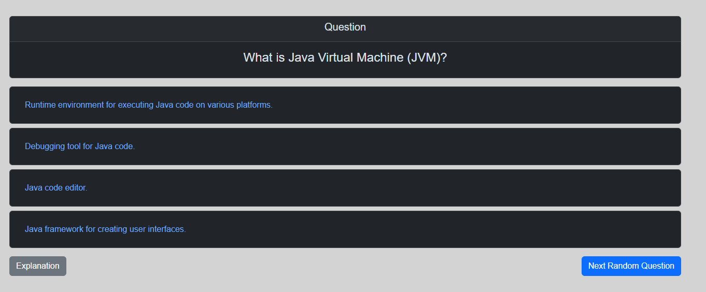

# QuizApplication

APPLICATION IS NOT WORKING FULLY YET!

## Table of Contents

1. [Description](#description)
2. [Installation](#installation)
3. [Usage](#usage)
4. [Application development](#Application development)

## Description

The interviews for all the juniors out there can be a terrifying thing. So for all the junits 
struggling with interviews this app will help you to prepare for them!  
This application is for all junior java developers trying to learn theory about basics that every 
junior should have. Each question here has own category, level and explanation so the user can 
not only check what he or she knows but also can learn about specific subject. The categories 
are : JAVA, SQL, LINUX, SPRING, GIT and some general knowledge - VARIOUS.

The running version of this application can be found under -> TO BE IMPLEMENTED 

But I encourage all the users to download this application and try to implement your own DB with 
questions that you find useful for your learning session. You can implement your own categories, 
levels and much more. 

## Installation

Steps to install the project:

I. Download the repository or the newest release form github.

II. Make sure that u have java in version 17 install on your PC!
TO DO!
III. If u downloaded repository u can run this project in your selected IDE. If you downloaded the jar file u can run the jar in terminal through command:
```
java -jar QuizApplication-0.0.1-SNAPSHOT.jar. 
```

Application should start properly in both cases.

## Usage

### Post Question
For now user can post question using some REST POST query using for example POSTMAN. 

url : http://localhost:8080/api/v1/questions/addQuestion

```json
{
"question": "What is pagination?",
"ansA": "Pagination is the process of dividing digital content into discrete pages.",
"ansB": "Pagination is a technique for encrypting data in web applications.",
"ansC": "Pagination is a method for optimizing the database through indexing.",
"ansD": "Pagination is a design pattern used in object-oriented programming.",
"goodAnswer": "Pagination is the process of dividing digital content into discrete pages.",
"level": "EASY",
"category": "VARIOUS",
"explanation": "Pagination is a technique used in web development to split content into separate pages, improving user navigation and reducing loading times. It is crucial for enhancing the usability and performance of websites or applications that handle large datasets or content. You can read more searching for codewords like 'web pagination best practices', 'implementing pagination', or 'pagination user experience'."
}
```

### GET Question  

url : http://localhost:8080/question/4



### Random Question

url : http://localhost:8080/randomQuestion


You can explore more on your own!

## Application development
This application is still in development. The goal is to deploy this to server, so it will be 
available for users around world.

Task that will be done:

-This application will implement basic microservice structure.

-There will be page for each category or page where can you choose category and level.

-There will be quiz containing 10 random question and will count your score. 

-There will be learning section where tou can just read questions with explanation for each one.


